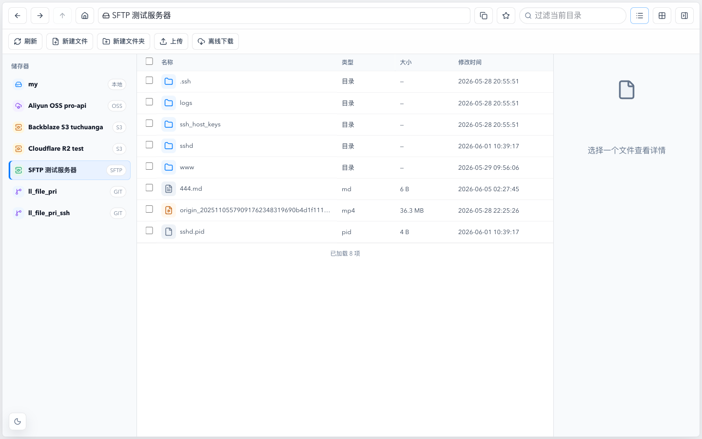
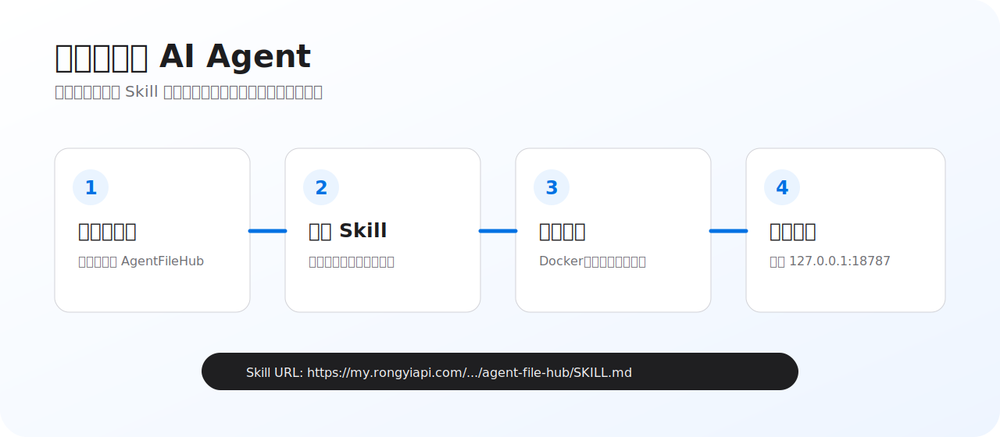
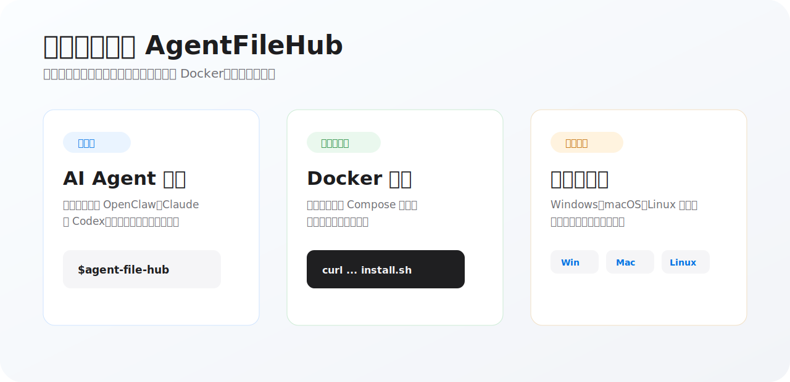
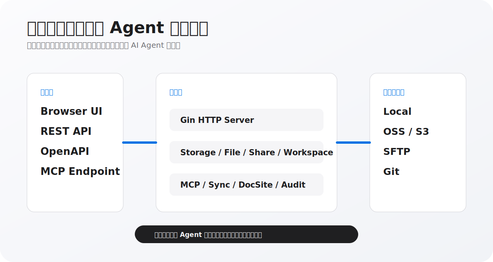

# AI智能体文件中枢

`ai-agent-file-hub` 是面向 AI 智能体时代的统一文件、记忆与技能基础设施。当前代码提供 Go + Vue 3 文件中枢，可统一接入本地目录、OSS、S3-compatible 对象存储、SFTP 服务器和 Git 仓库，并通过浏览器、REST、OpenAPI 与 MCP 暴露给人类用户和 AI 智能体。



## 一句话安装

把下面这句话发给 OpenClaw、Claude 或 Codex，智能体会读取安装技能，自动检查环境、选择安装方式、启动服务并验证访问地址。

```text
请帮我安装 AgentFileHub，安装技能: https://my.rongyiapi.com/ai-agent-file-hub/skills/agent-file-hub/SKILL.md
```



## 下载与安装

安装分为两种模式：服务器推荐 Docker 模式，本机体验和轻量部署可以直接下载对应系统二进制运行。



### 模式一：Docker 运行

```sh
u=https://my.rongyiapi.com
p=/ai-agent-file-hub/install.sh
curl -fsSL "$u$p" -o install.sh
bash install.sh
```

默认访问地址：`http://127.0.0.1:18787`

常用环境变量：

| 变量 | 默认值 | 说明 |
| --- | --- | --- |
| `AGENT_FILE_HUB_VERSION` | `v1.0.0` | 要部署的 Release 版本 |
| `HOST_PORT` | `18787` | 映射到宿主机的端口 |
| `AGENT_FILE_HUB_HOME` | `~/agent-file-hub` | 安装目录 |
| `FILE_BROWSER_AUTH_USERNAME` | `admin` | 初始化管理员用户名 |
| `FILE_BROWSER_AUTH_PASSWORD` | 空 | 初始化管理员密码，留空时进入页面初始化 |

手动 Docker Compose：

```sh
git clone https://github.com/duolabmeng6/ai-agent-file-hub.git
cd ai-agent-file-hub
AGENT_FILE_HUB_VERSION=v1.0.0 HOST_PORT=18787 sh run.sh
```

手动 Docker Run：

```sh
docker run -d \
  --name agent_file_hub \
  --restart unless-stopped \
  -p 18787:9000 \
  -e PORT=9000 \
  -e GIN_MODE=release \
  -e FILE_BROWSER_ROOT=/app/storage \
  -v agent_file_hub_data:/app/data \
  -v "$PWD/storage:/app/storage" \
  duolabmeng/agent_file_hub:v1.0.0
```

### 模式二：直接运行

Linux x64 示例：

```sh
curl -L -o agent_file_hub https://github.com/duolabmeng6/ai-agent-file-hub/releases/download/v1.0.0/agent_file_hub-linux-amd64
chmod +x agent_file_hub
PORT=18787 FILE_BROWSER_ROOT=./storage ./agent_file_hub
```

macOS 和 Windows 请在 Releases 下载对应架构文件运行。

### AI Agent 智能安装技能

把下面这一句话发给 OpenClaw、Claude 或 Codex。智能体会读取 Skill 文件，自动检查环境、选择安装方式、启动服务并验证访问地址。

```text
请帮我安装 AgentFileHub，安装技能: https://my.rongyiapi.com/ai-agent-file-hub/skills/agent-file-hub/SKILL.md
```

Skill 文件：

```text
https://my.rongyiapi.com/ai-agent-file-hub/skills/agent-file-hub/SKILL.md
```

### 系统要求

| 系统 | 最低版本 | 架构 |
| --- | --- | --- |
| Windows | Windows 10 及以上 | x64 / ARM64 |
| macOS | macOS 12 Monterey 及以上 | Intel x64 / Apple Silicon arm64 |
| Linux | glibc 或 musl 主流发行版 | x64 / ARM64 |
| Docker | Docker 24+，Docker Compose v2 | linux/amd64 / linux/arm64 |

### 二进制下载

访问 [Releases](https://github.com/duolabmeng6/ai-agent-file-hub/releases) 下载对应版本。

Linux：

| 文件 | 说明 |
| --- | --- |
| `agent_file_hub-linux-amd64` | x64 服务器二进制，下载后 `chmod +x` 运行 |
| `agent_file_hub-linux-arm64` | ARM64 服务器二进制，适合 ARM 云服务器和开发板 |

Windows：

| 文件 | 说明 |
| --- | --- |
| `agent_file_hub-windows-amd64.exe` | Windows x64 可执行文件 |
| `agent_file_hub-windows-arm64.exe` | Windows ARM64 可执行文件 |

macOS：

| 文件 | 说明 |
| --- | --- |
| `agent_file_hub-darwin-amd64` | Intel Mac 二进制，下载后 `chmod +x` 运行 |
| `agent_file_hub-darwin-arm64` | Apple Silicon 二进制，下载后 `chmod +x` 运行 |

一句话定位：

> AI Agent File Hub：面向智能体时代的统一文件、记忆与技能基础设施。

## 产品愿景

打造一个面向 AI 智能体时代的统一文件中枢，成为智能体的长期记忆中心、技能中心和协作中心。

系统通过统一管理分布在本地文件系统、Linux 服务器、OSS/S3 对象存储、Git 仓库和 SFTP 等位置的文件资源，为智能体提供标准化的文件访问能力、记忆管理能力和技能共享能力。

智能体可以把持续积累的知识、项目上下文、Prompt、Workflow、MCP 配置和工具说明以文件形式沉淀下来，再通过统一的 MCP 接口跨设备、跨环境、跨 Agent 访问同一套知识资产。

长期目标是成为 AI Agent 时代的 File OS，让文件成为智能体长期记忆、知识管理和能力复用的基础设施。

## 核心价值

### AI 长期记忆中心

系统把记忆沉淀为可读、可审查、可版本化的文件和目录。

- 通过目录结构组织 Wiki 型知识库
- 用 Markdown、文本、图片、PDF、压缩包等文件承载上下文
- 通过 Git 储存器记录历史版本、回滚内容和审计变更
- 通过 Workspace REST/MCP 接口让智能体按需读取、写入和搜索
- 用文件路径与目录索引降低 Token 消耗

### AI 技能中心

Prompt、Workflow、Agent 配置、MCP 配置、工具说明和项目规范都可以作为技能文件存放在统一目录中。

- 通过储存器统一管理技能资产
- 通过 Git 同步进行版本管理和跨设备分发
- 通过共享目录和 MCP Endpoint 让多个智能体加载同一套技能
- 后续路线扩展技能发现、安装、更新、组合和市场化分发

### AI 协作中心

多个 Agent 可以共享同一个记忆目录、技能目录或项目目录。

- 开发 Agent 读取代码规范、任务文档和变更历史
- 产品 Agent 维护 PRD、路线图和用户反馈
- 运营 Agent 使用素材库、页面发布和文档站点
- 客服 Agent 访问 FAQ、客户资料和处理记录

共享目录支持访问码、有效期、只读/上传/协作权限、访问统计和 Workspace 审计日志，适合把同一套文件资产开放给不同 Agent 使用。

## 两条技术路线

### 路线一：文件目录记忆

核心思想是为 AI 生成一本动态知识书籍。目录结构就是索引，文件内容就是可长期维护的知识页面。

```text
memory/
├── 公司知识
│   ├── 产品
│   │   ├── 产品A.md
│   │   └── 产品B.md
│   ├── 客户
│   │   ├── 客户A.md
│   │   └── 客户B.md
│   └── 项目
│       ├── 项目A.md
│       └── 项目B.md
└── skills/
    ├── prompts/
    ├── workflows/
    ├── mcp/
    └── agents/
```

AI 可以先读取目录，再精准读取目标文件。该路线适合结构化知识、项目上下文、团队规范、长期任务和可审查记忆。

### 路线二：向量记忆召回

Vector Memory 使用 Embedding 与向量数据库进行语义检索，适合海量文档、非结构化知识和模糊查询。

规划能力：

- 语义搜索
- 相似记忆召回
- 自动上下文补充
- 大规模文档索引
- Wiki 目录与 Vector 召回融合

### 双引擎融合

当前代码已经具备目录导航、文件名搜索、文档站点、Git 历史和 Workspace MCP。后续向量召回接入后，系统会形成“目录精准定位 + 向量智能补充”的双引擎记忆体系。

## 功能列表

### 已实现

| 模块 | 功能 |
| --- | --- |
| 储存器接入 | 本地目录、OSS、S3-compatible 对象存储、SFTP、Git 仓库 |
| 储存器管理 | 新增、编辑、克隆、删除、连接测试和多储存器切换 |
| 文件浏览 | 目录列表、分页加载、递归读取、文件元信息和路径导航 |
| 文件操作 | 上传、下载、新建、编辑、移动、重命名、复制、删除和批量删除 |
| 文件预览 | 图片、视频、音频、PDF、Markdown、文本和原始文件流 |
| 压缩解压 | ZIP 压缩、ZIP 解压、冲突策略和后台任务进度 |
| 对象存储能力 | OSS/S3 临时 URL、公开 URL、图片处理 URL 和 ACL/可见性信息 |
| Git 同步 | pull on open、auto push、手动同步、定时同步、状态恢复和冲突反馈 |
| Git 历史 | 文件历史版本、历史内容读取、历史 raw 下载和指定版本恢复 |
| GitHub 凭据 | GitHub CLI 状态检测、安装、设备登录、Token/凭据读取和 SSH key 发现 |
| 文件分享 | 单文件/目录分享、访问码、有效期、禁用状态、访问统计和公开访问 |
| 共享目录 | 只读共享、上传收集、协作目录、全局访问码和权限控制 |
| Workspace API | REST 接口、OpenAPI 3.1 文档、MCP Endpoint 和访问审计 |
| MCP 工具 | `info`、`list_files`、`read_text`、`write_text`、`upload_blob`、`read_blob`、`download`、`mkdir`、`delete`、`move`、`search` |
| 文档发布 | 静态页面分享、Markdown 文档站点和 Obsidian 风格文档站点 |
| 跨储存器同步 | 手动/定时同步、覆盖策略、过滤规则、运行历史和取消任务 |
| 账号安全 | 首次初始化、登录、退出和管理员账号密码修改 |
| 构建发布 | Vite 前端构建、Go 二进制构建、前端资源内置和 Linux 多架构构建 |

### 未实现/规划

| 模块 | 功能 |
| --- | --- |
| Vector Memory | Embedding、向量数据库、语义召回和相似记忆匹配 |
| 全文索引 | 文件索引、全文搜索、标签体系和自动知识归档 |
| Skill Center | 技能发现、下载、加载、更新、组合和版本管理 |
| Agent App Center | Agent 自主发布技能、维护知识库、推荐技能和自动安装 |
| 角色权限 | 管理 Agent、子 Agent、团队成员的角色化权限模型 |
| 更多储存器 | WebDAV、云盘、NAS 原生接入和更多对象存储平台 |
| 多 Agent 工作流 | 面向开发、产品、运营、客服等 Agent 的协作流程编排 |
| 知识治理 | 记忆去重、知识质量评分、过期内容清理和变更审批 |
| 部署运维 | Docker 镜像、云端部署模板、团队级配置和备份恢复 |

## 当前已实现能力

### 统一储存器

支持多储存器配置和统一文件操作。

- `local`：本地目录，NAS 可通过系统挂载路径接入
- `oss`：阿里云 OSS
- `s3`：AWS S3 与 S3-compatible 对象存储
- `sftp`：远程 Linux/SFTP 服务器，支持密码和私钥
- `git`：Git 仓库同步储存，支持只读/读写、pull on open、auto push 和定时同步

### 文件工作台

浏览器界面提供 Finder 风格文件管理。

- 列表、分页、递归读取和元信息查看
- 上传、下载、预览和原始流访问
- 新建文件、创建目录、文本编辑和 UTF-8 内容写入
- 移动、重命名、复制、删除和批量删除
- ZIP 压缩、ZIP 解压和冲突策略
- 图片、音频、视频、PDF、Markdown 和文本预览
- OSS/S3 临时 URL、公开 URL 和图片处理 URL

### Workspace REST / OpenAPI / MCP

共享目录可以生成 Workspace 访问码，并向智能体提供标准访问入口。

- REST Base：`/api/workspace/:code`
- OpenAPI 3.1：`/api/workspace/:code/openapi.json`
- MCP Endpoint：`/mcp/:code`
- 审计日志：记录来源、操作、路径、耗时、字节数和错误

MCP tools：

| Tool | 用途 |
| --- | --- |
| `info` | 返回 workspace 信息、权限和限制 |
| `list_files` | 列出目录内容 |
| `get_meta` | 读取文件或目录元信息 |
| `read_text` | 读取 UTF-8 文本文件 |
| `write_text` | 写入 UTF-8 文本文件 |
| `upload_blob` | 以 base64 上传单个二进制文件 |
| `read_blob` | 读取二进制文件并返回 base64 或 image content |
| `download` | 返回下载 URL |
| `mkdir` | 创建目录 |
| `delete` | 删除文件或目录 |
| `move` | 移动或重命名文件 |
| `search` | 按文件名搜索 local/Git workspace |

### 共享与发布

系统包含多种面向人和 Agent 的发布方式。

- 文件分享：为单个文件或目录创建公开链接
- 共享目录：为目录创建只读、上传收集或协作入口
- 页面分享：把储存器目录中的静态页面发布为公开页面
- 文档站点：支持 `static`、`markdown`、`obsidian` 类型文档站点
- 访问控制：支持访问码、过期时间、禁用状态和访问统计

### Git 版本与同步

Git 储存器用于把文件记忆和技能资产变成可追踪资产。

- HTTPS Token、SSH 私钥和无凭证模式
- GitHub CLI 状态检测、安装、设备登录和凭据读取
- 手动 pull/push、打开时 pull、变更后延迟 push
- 定时同步和同步状态恢复
- 文件历史版本查看、历史内容读取和指定版本恢复
- 冲突、鉴权失败、重试等待和只读状态反馈

### 跨储存器同步

同步任务支持在不同储存器之间复制目录。

- 手动运行和定时运行
- 分钟、天、周级计划
- 覆盖保留额外文件或覆盖删除额外文件
- ignore/allow 过滤规则
- 运行进度、错误列表、历史记录和取消任务

## MCP 接入示例

在界面中创建共享目录，选择“协作目录”权限，然后复制 Workspace 文档中的 MCP Endpoint。

```json
{
  "mcpServers": {
    "ai-agent-file-hub": {
      "type": "streamable-http",
      "url": "http://127.0.0.1:9000/mcp/<访问码>"
    }
  }
}
```

约束：

- 访问码只放在 URL path
- 所有 `path` 都是共享目录根内的相对路径
- 默认文本读取限制来自 `FILE_BROWSER_MAX_READ_SIZE`，默认值为 2 MB
- Workspace 二进制上传默认限制为 10 MB

## 技术架构



```text
web/app
  Vue 3 + Vite + Pinia + Tailwind CSS
        │
        ▼
cmd/server
  Gin HTTP API
        │
        ▼
internal/controllers
  Auth / Storage / File / Share / Workspace / MCP / Sync / DocSite
        │
        ▼
internal/services
  StorageManagerService / FileBrowserService / WorkspaceService
        │
        ▼
go-filesystem drivers
  local / oss / s3 / sftp / git
        │
        ▼
data/*.json
  storages / auth / shares / shared-folders / sync-tasks / doc-sites / audit
```

后端使用 Go + Gin，前端使用 Vue 3 + Vite。生产构建可以把前端资源通过 `embedweb` build tag 内置到 Go 二进制。

## 快速开始

依赖：

- Go `1.25.0`
- Node.js 与 npm

启动后端：

```bash
go run ./cmd/server
```

默认访问地址：

```text
http://127.0.0.1:9000
```

首次访问会进入初始化页面，设置管理员用户名和密码后进入系统。

前后端开发模式：

```bash
make dev
```

Vite 开发服务默认运行在 `http://127.0.0.1:5173`，`/api` 会代理到 Go 后端。

构建前端：

```bash
cd web/app
npm install
npm run build
```

构建带内置前端资源的生产二进制：

```bash
make build
```

构建多平台 Linux 发行目录：

```bash
make build-all
```

## 常用配置

配置文件默认写入 `data/` 目录。`data/storages.json` 会保存 OSS/S3/SFTP/Git 凭据，请把 `data/` 作为敏感运行目录管理。

```bash
# 服务端口
PORT=9000
FC_CUSTOM_LISTEN_PORT=9000

# 配置文件位置
FILE_BROWSER_STORAGES_PATH=/path/to/storages.json
FILE_BROWSER_AUTH_PATH=/path/to/auth.json
FILE_BROWSER_SHARED_FOLDERS_PATH=/path/to/shared-folders.json
FILE_BROWSER_WORKSPACE_AUDIT_PATH=/path/to/workspace-audit.jsonl
FILE_BROWSER_SYNC_TASKS_PATH=/path/to/sync-tasks.json
FILE_BROWSER_DOC_SITES_PATH=/path/to/doc-sites.json

# 初始账号
FILE_BROWSER_AUTH_USERNAME=admin
FILE_BROWSER_AUTH_PASSWORD=change-this-password

# 默认储存器
FILE_BROWSER_DRIVER=local
FILE_BROWSER_ROOT=/path/to/root

# OSS
FILE_BROWSER_OSS_BUCKET=example-bucket
FILE_BROWSER_OSS_REGION=cn-hangzhou
FILE_BROWSER_OSS_ENDPOINT=oss-cn-hangzhou.aliyuncs.com
FILE_BROWSER_OSS_PREFIX=assets
FILE_BROWSER_OSS_ACCESS_KEY_ID=xxx
FILE_BROWSER_OSS_ACCESS_KEY_SECRET=yyy
FILE_BROWSER_OSS_SECURITY_TOKEN=yyy

# S3
FILE_BROWSER_S3_BUCKET=example-bucket
FILE_BROWSER_S3_REGION=us-east-1
FILE_BROWSER_S3_ENDPOINT=https://s3.example.com
FILE_BROWSER_S3_ACCESS_KEY_ID=xxx
FILE_BROWSER_S3_ACCESS_KEY_SECRET=yyy
FILE_BROWSER_S3_USE_PATH_STYLE=true

# SFTP
FILE_BROWSER_SFTP_HOST=sftp.example.com
FILE_BROWSER_SFTP_PORT=22
FILE_BROWSER_SFTP_USERNAME=admin
FILE_BROWSER_SFTP_AUTH_MODE=password
FILE_BROWSER_SFTP_PASSWORD=secret
FILE_BROWSER_SFTP_ROOT=/data

# Git
FILE_BROWSER_GIT_URL=https://github.com/org/repo.git
FILE_BROWSER_GIT_BRANCH=main
FILE_BROWSER_GIT_ACCESS_MODE=read_write
FILE_BROWSER_GIT_AUTH_MODE=password
FILE_BROWSER_GIT_USERNAME=git
FILE_BROWSER_GIT_PASSWORD=github_pat_xxx
FILE_BROWSER_GIT_PULL_ON_OPEN=true
FILE_BROWSER_GIT_AUTO_PUSH=true
FILE_BROWSER_GIT_PERIODIC_SYNC=true
FILE_BROWSER_GIT_SYNC_INTERVAL_MINUTES=30

# GitHub CLI 安装和凭据读取
FILE_BROWSER_GITHUB_TOKEN=github_pat_xxx
FILE_BROWSER_GITHUB_CLI_PATH=/path/to/gh
```

## API 入口

认证：

- `GET /api/auth/status`
- `POST /api/auth/setup`
- `POST /api/auth/login`
- `POST /api/auth/logout`
- `PUT /api/auth/credentials`

储存器：

- `GET /api/storages`
- `POST /api/storages`
- `GET /api/storages/:id`
- `PUT /api/storages/:id`
- `PATCH /api/storages/:id`
- `DELETE /api/storages/:id`
- `POST /api/storages/:id/clone`
- `GET /api/storages/:id/git/status`
- `POST /api/storages/:id/git/sync`

文件：

- `GET /api/storages/:id/files`
- `GET /api/storages/:id/files/content`
- `PUT /api/storages/:id/files/content`
- `POST /api/storages/:id/files/upload`
- `PUT /api/storages/:id/files/move`
- `PUT /api/storages/:id/files/copy`
- `DELETE /api/storages/:id/files`
- `POST /api/storages/:id/files/archive`
- `POST /api/storages/:id/files/extract`
- `GET /api/storages/:id/files/history`
- `POST /api/storages/:id/files/history/restore`

协作与发布：

- `GET /api/shares`
- `GET /api/shared-folders`
- `GET /api/workspace/:code/info`
- `GET /api/workspace/:code/openapi.json`
- `POST /mcp/:code`
- `GET /api/page-shares`
- `GET /api/doc-sites`
- `GET /api/sync-tasks`

## 验证

```bash
go test ./...
cd web/app && npm run build
```

文档改动可执行轻量校验：

```bash
git diff -- readme.md
```

## 路线图

- Vector Memory：Embedding、向量数据库、语义召回和上下文补充
- Skill Center：技能发现、下载、加载、更新、组合和版本管理
- Agent App Center：Agent 自主发布技能、维护知识库和推荐能力
- 更多储存器：WebDAV、云盘、NAS 原生接入和更多对象存储平台
- 权限体系：面向管理 Agent、子 Agent、团队成员的角色化授权
- 索引体系：文件索引、全文搜索、标签体系和自动知识归档

## License

开源发布前请补充 `LICENSE` 文件，并在本节标注许可证。
